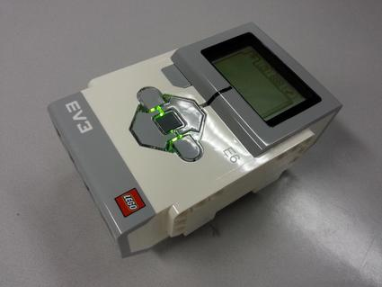

# Lego Mindstorms EV3

This is the base Nerves System configuration for the Lego Mindstorms EV3 brick.

 [Image credit](#wikipediaref)

| Feature              | Description                     |
| -------------------- | ------------------------------- |
| CPU                  | 300 MHz ARM926EJ-S              |
| Memory               | 64 MB DRAM                      |
| Storage              | 16 MB Flash and MicroSD         |
| Linux kernel         | 4.4 w/ ev3dev patches           |
| Display              | 178x128 LCD - /dev/fb0          |
| IEx terminal         | Optional - ttyS1 via port 1 ([console adapter](http://www.mindsensors.com/ev3-and-nxt/40-console-adapter-for-ev3) required) |
| GPIO, I2C, SPI       | Yes - ev3dev drivers            |
| ADC                  | Yes                             |
| PWM                  | Yes, but no Elixir support      |
| UART                 | 4 available - ttyACM0           |
| Speakers             | Built-in speaker - ALSA         |
| Camera               | None                            |
| Ethernet             | Requires USB Ethernet dongle    |
| WiFi                 | Requires USB WiFi dongle        |
| Bluetooth            | Not supported                   |

## Example projects

Since the documentation is sparse here, you may find some example projects
helpful:

* https://github.com/fhunleth/nerves_ev3_example

If you have a project to share, please help us by adding it to the list and
sending a pull request. Thanks!

## Lego device kernel modules

The Lego device kernel modules are not built into the kernel so they need to be loaded by your application at initialization time. To do this, run:

    modprobe suart_emu
    modprobe legoev3_ports
    modprobe snd_legoev3
    modprobe legoev3_battery

When Nerves supports Bluetooth, you'll want to run the following line as well:

    modprobe legoev3_bluetooth

## Console access

The EV3 supports a special UART output on port 1. Nerves uses this output for Linux kernel debug messages and an IEx prompt. If you plan on doing any Linux kernel, driver, or boot related work with the EV3, this console is indispensable.

You will either need to buy a [console adapter](http://www.mindsensors.com/ev3-and-nxt/40-console-adapter-for-ev3) or build [one](http://botbench.com/blog/2013/08/15/ev3-creating-console-cable/) to use this port.

Loading the `legoev3_ports` driver automatically disables the console port. Since we're working on the EV3
and it's not as easy to use as it should be, we've told the `legoev3_ports`
module to not touch it. If you're on the EV3, you'll see the following line in
`/etc/modprobe.d/ev3dev.conf`:

    options legoev3_ports disable_in_port=1

If you want to use port 1, you'll need to disable this. To do this, add a
`/etc/modprobe.d/ev3dev.conf` to your project's `rootfs-additions`. If an empty file exists, it will override this default one, but I
usually create a file with the line commented out so that I remember what
the special line is.

## Supported USB WiFi devices

The base image includes drivers and firmware for Ralink RT53xx
(`rt2800usb` driver) and MediaTek MT7601U (`mt7601u`) devices. One option for
these devices is to get a Tenda W311MI Wireless USB Adapter.

We are still working out which subset of all possible WiFi dongles to
support in our images. At some point, we may have the option to support
all dongles and selectively install modules at packaging time, but until
then, these drivers and their associated firmware blobs add significantly
to Nerves release images.

If you are unsure what driver your WiFi dongle requires, run Raspbian and configure WiFi
for your device. At a shell prompt, run `lsmod` to see which drivers are loaded.
Running `dmesg` may also give a clue. When using `dmesg`, reinsert the USB
dongle to generate new log messages if you don't see them.

## Wired Ethernet

If you have a USB Ethernet adapter, find the driver for it on your PC. For
example, plug it in and check `dmesg` and `lsmod` to see which driver it loads.
In my case, I have an adapter that loads the `asix` driver. Make sure that your
driver is compiled in as a module to the Linux kernel in Nerves and then
manually load the driver via `modprobe asix`.

## Power down, halt, reboot

On most platforms, the default behavior of Nerves is to hang if something goes wrong.
This is good for debugging since rebooting makes it easy to lose console
messages or it might hide the issue completely. Hanging on the EV3 forces you
to remove and reinsert the batteries since there's no reboot button. The default
behavior has been changed to power down instead.

If you're attached to the console, you may see a kernel panic when you run power
off. From what I can tell, this panic happens after the important parts of
shutting down gracefully have completed and does not cause a problem.

## Installation

If [available in Hex](https://hex.pm/docs/publish), the package can be installed as:

  1. Add nerves_system_ev3 to your list of dependencies in `mix.exs`:

        def deps do
          [{:nerves_system_ev3, "~> 0.7.0"}]
        end

  2. Ensure nerves_system_ev3 is started before your application:

        def application do
          [applications: [:nerves_system_ev3]]
        end

## SDCard vs. internal NAND Flash notes

The EV3 brick has a 16 MB NAND Flash inside it that's connected to SPI bus 0.
It doesn't look like the ev3dev project has included support for it yet except
in their version of u-boot. The means that it can only be programmed using the
Lego supplied tools. The 16 MB NAND Flash also has a couple other issues. First,
it appears to be super slow. This leads to them copying the whole image to
DRAM instead of reading it as needed. It appears that this uses up 10 MB of
DRAM compared to running off the SDCard. This is significant when you consider
that the board only has 64 MB total DRAM. On the other hand, programming the
internal NAND Flash is cool and the direction that we'd prefer to go on
production systems.

Currently, the u-boot in the internal NAND Flash that's supplied by Lego and the
ev3dev project expects the `uImage` in the first VFAT partition. Ideally, it
would extract it out of the rootfs so that we could implement more atomic
firmware updates. To avoid the need to reflash the firmware to use Nerves, I'm
staying with the existing mechanism.

## ev3dev

This port draws substantially on the [ev3dev](http://www.ev3dev.org/)
project. In general, if there's a way to do something in ev3dev,
it can be made to work in Nerves. Nerves uses the same Linux kernel
from the ev3dev project and enables the same set of custom drivers
that were created by the ev3dev developers.

[Image credit](#wikipediaref): By Klaus-Dieter Keller - Own work, CC BY-SA 3.0, https://commons.wikimedia.org/w/index.php?curid=29156877
